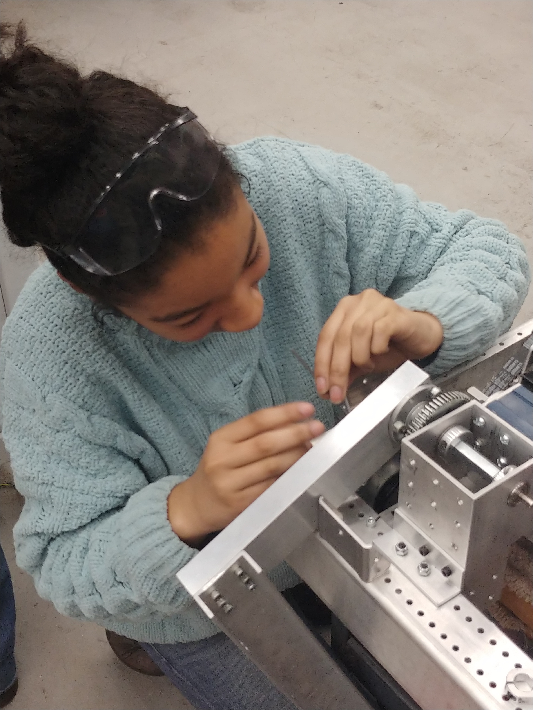
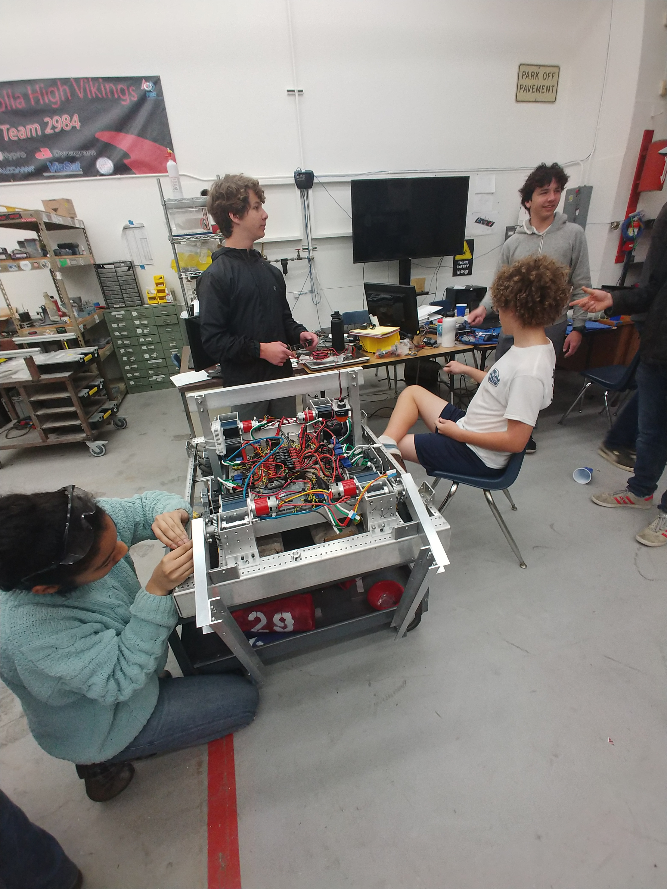
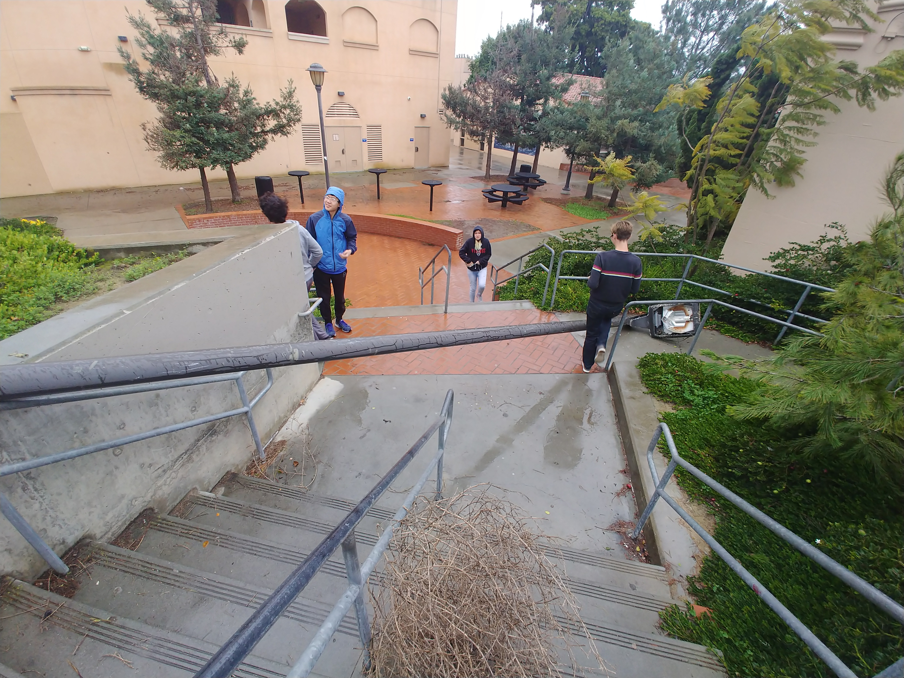

Our electrical team decided to learn rust today, nothing else productive was done, they drank some rain water, some concern about them was raised for potentially harming themselves however not enough damage was seen to create cause for concern. If Electrical is all sick in a few weeks, this is likely the cause.

Mechanical Have the frame of our robot completed and started to assemble our robot. The accomplishments of mechanical are not to be understated today, a great thing has been completed.

Rain has happened today, this has caused a mild craze with both a lamp post and multiple light fixtures being taken down by wind and rain. Our robot also has a new name, pandora. It was named so because electrical decided it was like an unfolding box.

With the end of the build season fast approaching, the sense of comradery between us all has grown, and while the end may be near these experiences will last a lifetime.

