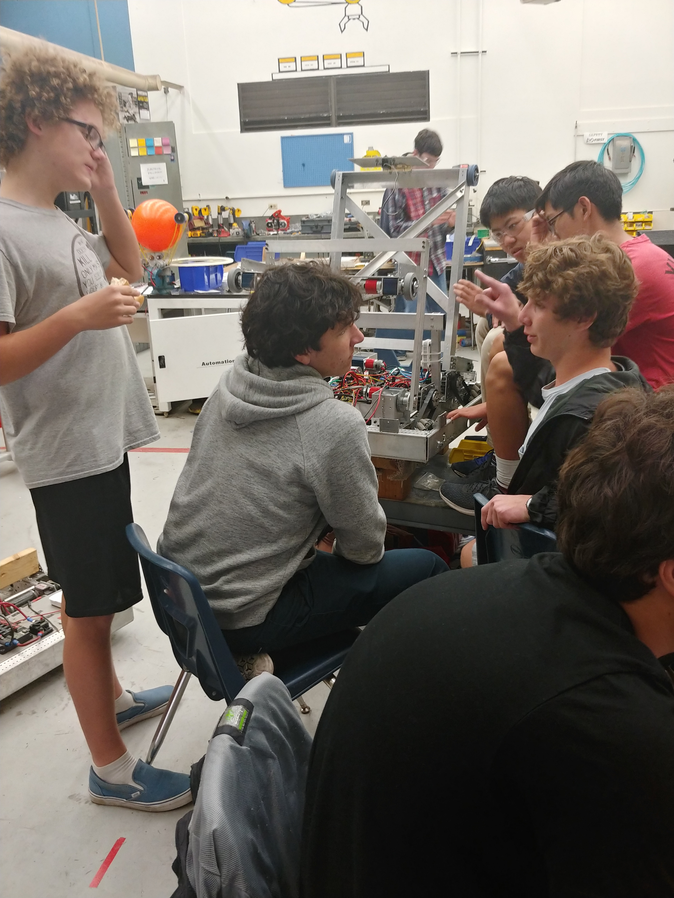

Hello and welcome to the regularly scheduled blog, our generous benefactors who provide food and knowledge to create the robot. As the climbing mechanism is affixed to the robot, its rigidity questioned and the design refined, the black hole of food that is drive team might actually become relevant. While the robot is not yet in a drive-able state, they toil away while the electrical team works on the framework to build a robot that will be competitive. Communications which has faithfully maintained the website through thick and thin, correcting a series of merge errors as well as working to create a better website has been working on poster designs.
This leads to the black hole of this blog post, drive team, while an extremely important team, they have done next to nothing while simultaneously consuming the most amount of food any other team. While this behaviour would be justified if it was another team, like electrical or mechanical, drive team eclipses the consumption of either of the two teams during weekday meetings.

Meanwhile in other news, a new design flaw has been uncovered, the screws being hit when one of the arms is brought up to rest, repeated impacts will likely damage the robot shearing the screws as well as causing further damage to other components in the path of the arm. This is a problem that can be fixed in a variety of ways however is the major obstacle that is faced by the mechanical team at the moment.

Electrical is currently attempting to determine if the intake will function at other degrees of elevation to create further ranges for the intake.

Drive team is throwing tangerines at each other, likely a contributing factor to the mouse problem, as well as threatening each other with a bible, where they got a bible we don't know, they are the special team for a reason.

