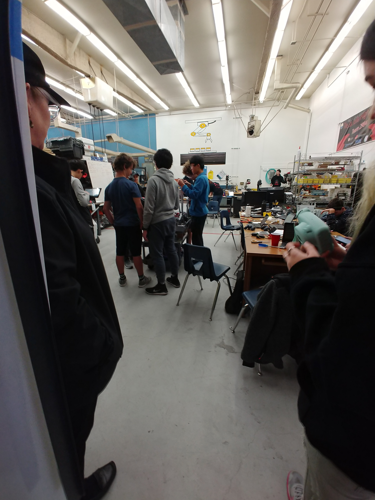
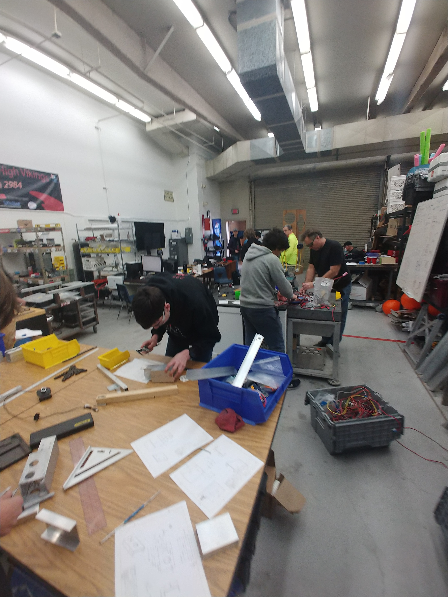

Nearing the end of the build season, we have a tons of problems and have begun working on the final attempt to climb, as well as attempting to complete the robot. Electrical works on completing the intakes and climbing, making sure the robot moves and functions to a reasonable degree of competence. We will persevere through the challenges we face, and while behind on the build schedule, the robot is in fact drive-able.

Hoodies and T-shirts are now available for team members and hopefully pins will be available in a timely matter.

Mechanical continues to manufacture parts and our hopes for a better future continue to give us hope that we will succeed at competition and our other endeavors.

