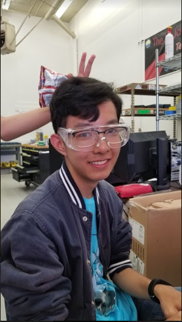

With the continued existence of our robotics team, we continue to work out the kinks to prepare for battle at the border.
Having passed club day, we are in full scale prep mode for the upcoming competition with way too much Caravan Palace.
Should any questions arise from this blog post, I blame Marshall.

A new mentor has joined us, Eric Xiao a computer science major from UCSD who is mentoring our electrical and software team,
I'm cool boy

"Hey guys join team 253 we have boba ;)" - Eric Xiao

Mechanical is busy still making bumpers and assembling thicc-bot. so all general cad-ing and building you're used to.

Communications is meeting Eric Xiao and I'm testing the waters to see how he feels about
the blossoming friendship and to see his story, he's like an old western cowboy who has seen the world.
(Even though he's only 18)

Electrical is busy giving java mentors to the new students, and seeing what information Eric has to tell them because he's pretty smart.

Comms is doing fund raising and blog writing and just kinda collecting information with logistics to see where the team is at and welcome new members with open arms to this team.

Join us on discord <a href="https://discordapp.com/invite/RshDdxa">here</a>

