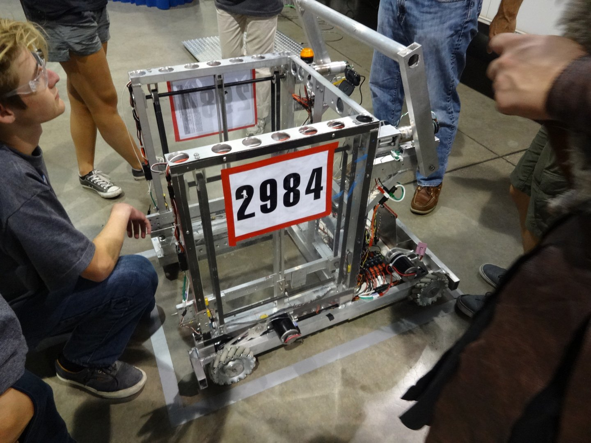
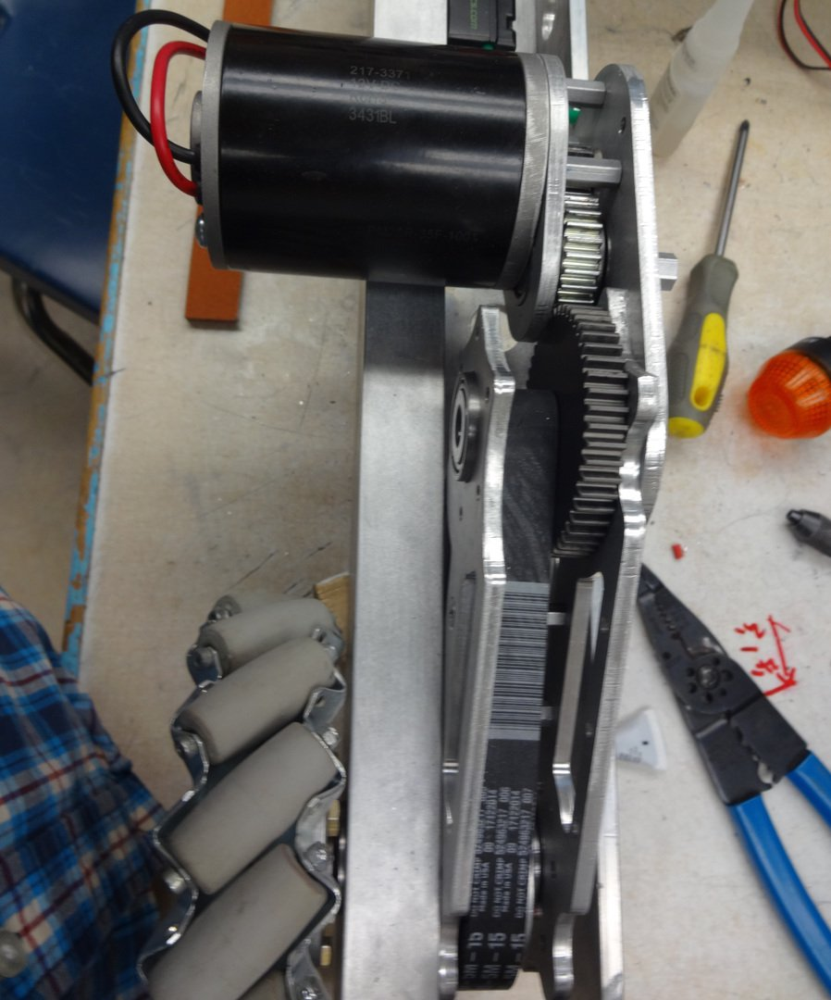

# Our Plan

Robobo was our team’s robot for the 2015 season. Its main purpose was to stack totes (boxes) which it did using an elevator mechanism. The elevators on the sides of the lifting cage would move up and down to pick up a tote. Every time they were up we would drive up to another tote and have it slide under the previous tote(s). Then we would lower the elevators and the hooks would release the lifted tote and grab on to the bottom tote. We could then repeat this process as many times as we wanted. The lifters included encoders so that the software could move them to the appropriate positions upon the direction of the operator.

A cool feature of our robot were the transmission. We made them ourselves which allowed us to incorporate the flexibility we needed into the design itself. Instead of being fixed in one position we were able to configure them into a multitude of positions. We could pivot the motor position around the belt portion, then the whole assembly could be rotated around the axle that it is attached to.

This was of great use to use because we had a very limited amount of space on our robot. In the front we needed to keep everything as close to the x-axis as possible. To do this we rotated the transmissions so that the motor was just above the axle but was displaced towards the back of the robot.

# Our Shortcomings

One thing we fell short on was testing the mechanism throughly. The elevator mechanism was a great idea yet we didn't create a prototype that showed that this would be a efficient idea to implement.

# The Game

  <iframe src="https://www.youtube.com/embed/W6UYFKNGHJ8" allowfullscreen></iframe>

