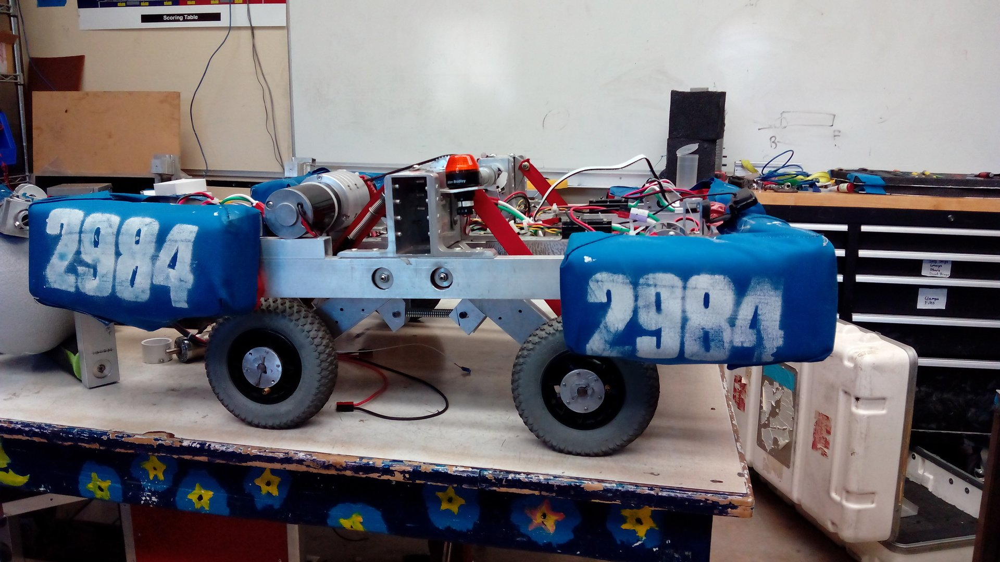
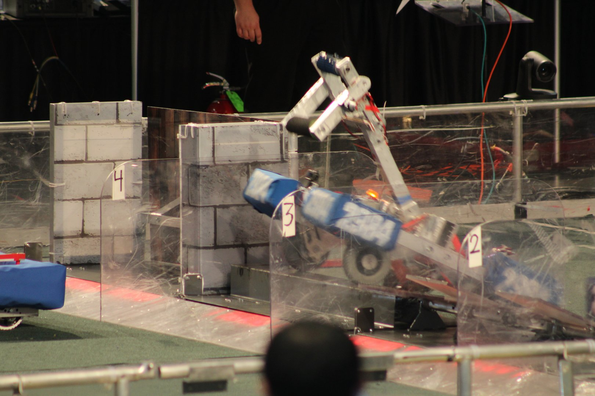

# Official Documentation

- [Stronghold Wiki](https://en.wikipedia.org/wiki/FIRST_Stronghold)
- [Game Manual](/pdfs/stronghold-2016/manual.pdf)
- [Game Manual Update 21 (combined Team Update)](/pdfs/stronghold-2016/team-updates.pdf)

# Our Plan

Unlike many other robots we tried to focus solely on a robot that could cross all the terrain on the field instead of scoring balls into the castle.

Our independent suspension between our 4 mecanum wheels was such a unique strategy that we didn't see any other team implement it through the two competitions we went to.

Maybe it was our small team or maybe we didn't plan too far in advance, but this year wasn't too great as well. We weren't last but we were definitely far from first.

# Our Shortcomings

This year could have benefited from focusing on just the terrain. Our arm wasn't up to the stress of the competition and although it was a good idea the work put into it couldn't be full realized since it broke during the competition.

# The Game

  <iframe src="https://www.youtube.com/embed/VqOKzoHJDjA" allowfullscreen></iframe>

